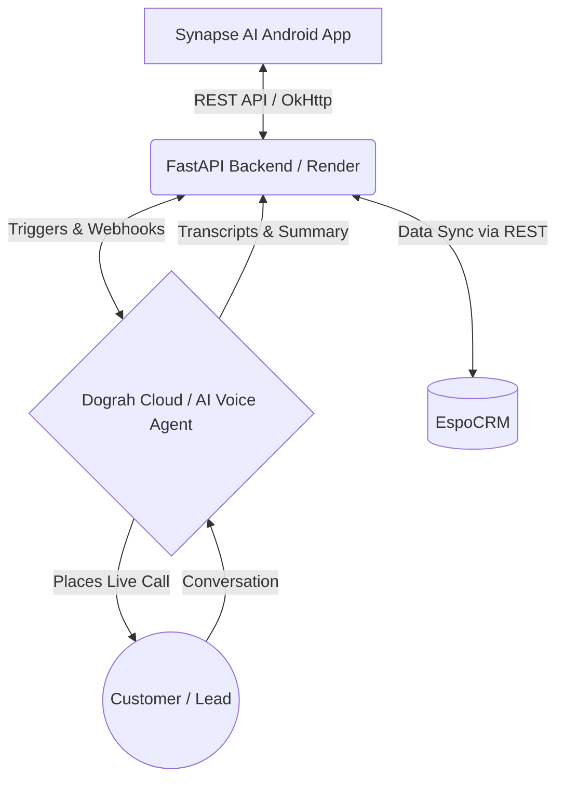

# Synapse AI — Tele-Calling AI Orchestrator

**Synapse AI** is a professional, mobile-first orchestrator built to manage and trigger autonomous AI voice agents. It serves as the frontend command center for the **Vedaspark/Dograh Cloud AI ecosystem**. The application enables users to manage CRM contacts, trigger real-time AI phone calls to leads, schedule future calls, and monitor incredibly detailed analytics (live call transcripts, intent tracking, and sentiment analysis).

---

## 🏗️ System Architecture

The project relies on a modern micro-architecture connecting mobile, backend, AI orchestration, and CRM layers.



### Component Breakdown
1. **Android App (Synapse AI):** The control layer. Uses Jetpack Compose for UI, Coroutines/Flow for asynchronous UI updates, and OkHttp/Retrofit for networking. It continuously polls the server to provide real-time updates without manual refreshes.
2. **FastAPI Backend (Orchestrator):** The middleware layer hosted on Render. Handles database queries, structures analytics, and routes requests between the mobile app, EspoCRM, and the voice AI provider.
3. **Dograh Cloud (Voice AI):** The underlying engine that physically dials phone numbers and holds natural-language conversations with leads (e.g., advising on college admissions).
4. **EspoCRM:** The enterprise CRM acting as the definitive source of truth for Lead data. 

---

## ⚙️ Setup & Configuration (For Developers)

To run this project locally or connect it to your own backend environment, you need to configure the API endpoint.

### 1. Changing the Backend URL
The application is configured to read the backend URL securely from your local environment properties. 
Do **NOT** hardcode URLs in the Kotlin files. 

1. Open the project in Android Studio.
2. Locate the file named `local.properties` in the root directory of the project.
3. Add or update the following line with your live API URL (e.g., your Render, AWS, or Ngrok URL):
   ```properties
   FASTAPI_BASE_URL=https://synapse-ai-ryu9.onrender.com
   ```
4. Rebuild the project. Gradle automatically injects this URL into `BuildConfig`.

### 2. Changing the Master User ID
For this MVP, the application synchronizes data for a specific account identifier so the app and web dashboard mirror the same data.
*   File Location: `app/src/main/java/com/example/synapseai/data/model/Models.kt`
*   Locate the `UserIdConstants` object and modify the ID if needed:
    ```kotlin
    object UserIdConstants {
        const val MASTER_USER_ID = "synapse_mvp_2024" 
    }
    ```

---

## 📱 Comprehensive User Manual

### 1. The Dashboard (Command Center)
Upon opening the app, the Dashbaord provides an immediate overview of campaign health.
*   **System Heartbeat:** The top right corner features a pulsing "Online/Offline" indicator to verify the mobile-to-backend connection.
*   **Live Metrics:** Views metrics like Total Calls, Conversion Rates, callbacks, and engagement scoring. These update **automatically every 20 seconds**.
*   **Intent Distribution Bar:** A visual breakdown showing how many leads were mathematically calculated by the AI as *Interested*, *Not Interested*, or *Info Seeking*.
*   **Recent Activity Log:** A quick-glance list of recent calls, displaying the AI-generated context summary.

### 2. Contacts & CRM Sync
The Contacts tab synchronizes your local address book with your EspoCRM server.
*   **Auto-Fetching:** When the screen opens or via background polling (every 30s), the app pulls new leads created in EspoCRM into the mobile list safely preventing duplicates.
*   **Push to CRM:** Press the floating (+) icon to add a contact manually in the app. Then press the "Push to CRM" button at the bottom to dynamically push new mobile leads up to the EspoCRM cloud database.
*   **Quick Dial:** Tapping the phone icon next to any name instantly dispatches the Dograh Voice AI agent to dial that person's phone number.

### 3. Smart Dialer
For fast, ad-hoc calling without saving a lead first.
1. Enter the target **Phone Number** (include country codes, e.g., `+91...`).
2. Enter the **Lead Name** (this is critical so the AI greets them properly and contextualizes the pitch).
3. Press **Dial**. The app immediately fires the webhook, placing the target device in ringing status.
4. The history log refreshes instantly once the trigger is successful.

### 4. Call Scheduling
If a lead requests a callback or a campaign must start later.
1. Pick a Date and Time using the intuitive Android date/time pickers.
2. Set a **Retry Count** (0-5) instructing the AI on how many times to re-dial if the lead fails to answer.
3. The queue of scheduled calls appears underneath the form.
4. **Cancelation:** Tap "Cancel" on any pending call sequence before the trigger time is reached to abort it.

### 5. Call History & Analytics View
The history view acts as a deep-dive CRM log for your AI interactions.
*   **Full Call Summary Sheet:** Tap on any finished call in the list. A bottom sheet will slide up containing deep analytics.
*   **AI Summary Box:** A 2-to-3 sentence summarization written by the LLM assessing why the call succeeded or failed.
*   **Audio Recording:** Tap "Listen to Recording" to launch an external browser link playing the raw MP3/WAV audio of the phone call.
*   **Full Transcript View:** A beautifully-rendered chat bubble interface showing the line-by-line transcript (Purple bubbles for the AI Agent, Cyan bubbles for the Human Lead).

---

## 💻 Codebase Structure Guide

For future development or handoff, the Android project is structured using the MVVM (Model-View-ViewModel) architecture.

*   **`ui/screens/`**: Contains the Jetpack Compose UI logic. (`DashboardScreen.kt`, `CallHistoryScreen.kt`, `ContactsScreen.kt`, etc.)
*   **`ui/components/`**: Reusable generic UI elements like `GlassCard`, `GradientButton`, `PulseIndicator`, etc.
*   **`ui/viewmodel/`**: Houses the state management and background polling Coroutine loops that fetch data every 15-30s.
*   **`data/model/`**: Kotlin Data Classes mapped to the FastAPI JSON structures (e.g., `CallHistoryEntry`, `TriggerCallRequest`).
*   **`data/api/`**: The Retrofit `FastApiService` definitions for network communication.
*   **`data/repository/`**: Abstraction layer that binds views to network payloads.

## 📝 Build Instructions
1. Open the project folder in Android Studio (Iguana/Jellyfish or newer, using Gradle 8+).
2. Wait for Gradle Sync to complete.
3. From the terminal, run `./gradlew assembleDebug` to build the APK, or simply press the green "Run" button to deploy onto your target Android device.
